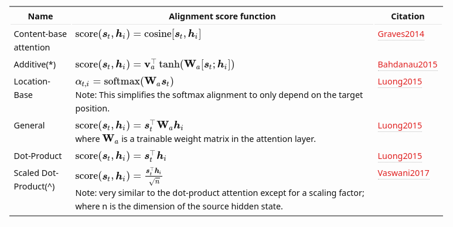
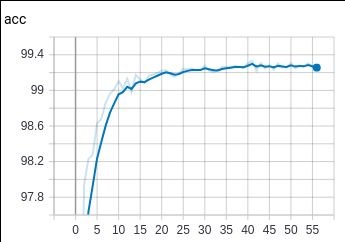
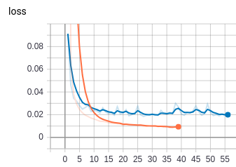
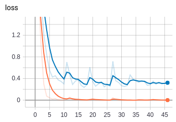
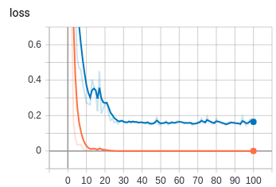

class: center, middle

# Morphological Inflection using Encoder-Decoder-Networks

Andreas Madsack (mfa)

mlugs<br/>
2019-05-21

---

# Agenda

1. Problem description: Encoder-Decoder

2. Building blocks

3. Morphological Inflection

4. Sigmorphon 2019 Task 1

---

# Agenda

1. Problem description: Encoder-Decoder

2. .gray[Building blocks]

3. .gray[Morphological Inflection]

4. .gray[Sigmorphon 2019 Task 1]

---

## Sequence to Sequence


(img src: http://karpathy.github.io/2015/05/21/rnn-effectiveness/ )

---

## Examples for Encoder-Decoder

- Translation

--

- Named Entity Recognition

--

- POS tagging

--

- Speech Recognition

--

- Morphological Inflection

--

- ⋯

---

## Encoder-Decoder


(img src: https://medium.com/syncedreview/a-brief-overview-of-attention-mechanism-13c578ba9129 )


---

## Important!


- The last *hidden-state* of the **encoder** is part of the *input* of the **decoder**!

(img src: https://github.com/bentrevett/pytorch-seq2seq/ )


---

## Problems to solve:

- Input and output lengths differ

- Vanishing gradient (neural network's weights gets too small to train further)

- Filter implausible outputs


---

# Agenda

1. .gray[Problem description: Encoder-Decoder]

2. Building blocks

3. .gray[Morphological Inflection]

4. .gray[Sigmorphon 2019 Task 1]

---

## Different input/output lenghts

- masking all non characters to 0 (padding)

- input and output sequences can be different maximums

---

## Embeddings

- Everything in a neural network has to be a tensor

--

- Tensors are a **generalization of matrices** and are represented using **n-dimensional arrays**

--

- Inputs to Tensors:

  * one-hot-encoding

--
  * embeddings for all kinds of categorical data

--
  * word2vec, fasttext, ELMO, GPT, Ulmfit, BERT, GPT2

--
  * trained with the neural network

---

## Cells

RNN  | GRU  | LSTM
---- | ---- | -----
 |  | 

(img src https://medium.com/@saurabh.rathor092/simple-rnn-vs-gru-vs-lstm-difference-lies-in-more-flexible-control-5f33e07b1e57 )

---

## Attention (is all you need)


(img src: https://medium.com/syncedreview/a-brief-overview-of-attention-mechanism-13c578ba9129 )

---

## Different Attention algorithms



(src: https://lilianweng.github.io/lil-log/2018/06/24/attention-attention.html )

---

## Soft Attention vs. Hard Attention

- soft attention: resembles attention with a weighted context vector

- hard attention: decisions about elements in the context vector made using a function (crop, (pre-)trained vector, ...)


State-of-the-art for morphology inflection:  
[Exact Hard Monotonic Attention for Character-Level Transduction](https://arxiv.org/pdf/1905.06319.pdf)  
(ACL2019)

---

## Attention helps you visualize!


(img src: https://bastings.github.io/annotated_encoder_decoder/)


---

## optimizer / learning rate


(img src: http://ruder.io/optimizing-gradient-descent/ )

- Adam, Adadelta, Adagrad, RMSprop

- RMSprop, Adadelta, and **Adam** are very similar algorithms

- learning rate schedulers (i.e. reduce learning rate on plateau )

---

## greedy vs. beam-search

- greedy chooses most probably item at the current step

- beam search expands all possible next steps and keeps the k most likely

- beam search is not part of the training ⟶ no learning of errors based on it.

---

# Agenda

1. .gray[Problem description: Encoder-Decoder]

2. .gray[Building blocks]

3. Morphological Inflection

4. .gray[Sigmorphon 2019 Task 1]

---

## Morphological Inflection

Example:

**sehen** ⊞ V;PST;3;PL ⟶ **sahen**

(3rd person past tense plural)

---

## Setup encoder-decoder model in AllenNLP

```json
"model": {
  "type": "seq2seq",
  "max_decoding_steps": 90,
  "beam_size": 10,
  "attention": {
    "type": "dot_product"
  },
  "source_embedder": {
    "tokens": {
      "type": "embedding",
      "embedding_dim": 200
    }},
    "encoder": {
      "type": "lstm",
      "input_size": 200,
      "hidden_size": 400,
      "bidirectional": true,
      "num_layers": 2,
      "dropout": 0.4
    }}
```

---

## Train the model

```json
"trainer": {
  "cuda_device": 0,
  "num_epochs": 100,
  "optimizer": {
    "type": "adam"
  }}
```

command to train:

```json
allennlp train config.json -s output --include-package library
```

---

## See performance in Tensorboard

**English** **verbs** trained on Unimorph:

accuracy | loss
-------- | ----
|

(orange: training / blue: validation)

live: http://10.1.2.9:6006/ (internal only)

---

## Predict


test_data.txt:
```markdown
tenron	tenroned	V;PST
tenron	tenroning	V;V.PTCP;PRS
tenron	tenrons	V;3;SG;PRS
deutsch	V;3;SG;PRS
```

command:

```python
allennlp predict model.tar.gz test_data.txt --use-dataset-reader \
  --predictor seq2seq --include-package library
```

---

## Predict (output)

```json
input:  Instance with fields:
         source_tokens: TextField of length 14 with text:
                [@start@, t, e, n, r, o, n,     , V, ;, P, S, T, @end@]
                and TokenIndexers : {'tokens': 'SingleIdTokenIndexer'}
         target_tokens: TextField of length 10 with text:
                [@start@, t, e, n, r, o, n, e, d, @end@]
                and TokenIndexers : {'tokens': 'SingleIdTokenIndexer'}

prediction:  {"predictions": [[11, 2, 13, 9, 16, 13, 2, 17, 4, 4],
[11, 2, 13, 9, 16, 13, 17, 4, 4, 4], [11, 2, 13, 9, 16, 13, 11, 4, 4, 4],
[11, 2, 13, 16, 9, 13, 2, 17, 4, 4], [11, 2, 13, 9, 16, 13, 22, 2, 17, 4],
[11, 2, 13, 9, 16, 13, 13, 2, 17, 4], [11, 2, 13, 9, 16, 13, 4, 4, 4, 4],
[11, 2, 13, 9, 16, 13, 48, 17, 4, 4], [11, 2, 13, 9, 16, 13, 11, 2, 17, 4],
[11, 2, 13, 9, 16, 13, 31, 2, 17, 4]], "loss": 0.0002800623478833586,
"class_log_probabilities": [-0.0025205612182617188, -6.190673828125,
-8.745232582092285, -9.586219787597656, -10.127161026000977, -10.5797700881958,
-10.609740257263184, -10.712018013000488, -11.10799503326416, -11.114752769470215],
"predicted_tokens": ["t", "e", "n", "r", "o", "n", "e", "d"]}
```

---

# Agenda

1. .gray[Problem description: Encoder-Decoder]

2. .gray[Building blocks]

3. .gray[Morphological Inflection]

4. Sigmorphon 2019 Task 1

---

## Sigmorphon 2019 Task 1

- **cross-lingual transfer for inflection in low-resource languages**

- Data from high-resource language to train for a low-resource language

- 99 language pairs

---

## language pairs

pair | &nbsp;&nbsp; |differences
:---- | --- | :-----
adyghe--kabardian || very similar
czech--latin || different features
danish--yiddish || different charsets and features
belarusian--old-irish || very different (charset + features)
...

---

## our solution (attempt)

- train on high+low data until validation is not improving for 5 epochs

- after that trian only with low data

--

high+low training | high+low ⟶ low training
--- | ---
 | 

- Transfer learning is better than only high+low


---

## Paper / Source code

- https://github.com/axsemantics/sigmorphon2019-task1

- Paper is submitted (review at end of May)

---

## Thanks!
