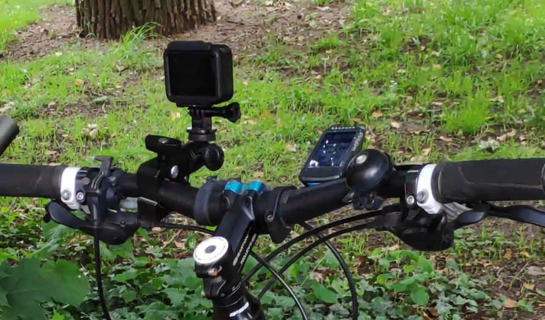

class: center, middle

# Extract GPS from JPG Images

Andreas Madsack (mfa)

datenobservatorium 
2019-09-09

---

## Problem

- lots of images for openstreetcam: https://openstreetcam.org/user/madflex

- lots are atm 680.000 images => 3500km tracks

- made using a GoPro:

- Goal: a (static) map with all image locations marked

---

## First idea. PIL / Pillow

- see <https://gist.github.com/erans/983821>

- messy code but works

---

## Second option: exifread

- <https://pypi.org/project/ExifRead/>

- nicer solution

- example: https://gist.github.com/erans/983821

---

## Demo

---

## Next

- paint all the points on tiles

- for example using <https://github.com/hugovk/osmviz>
