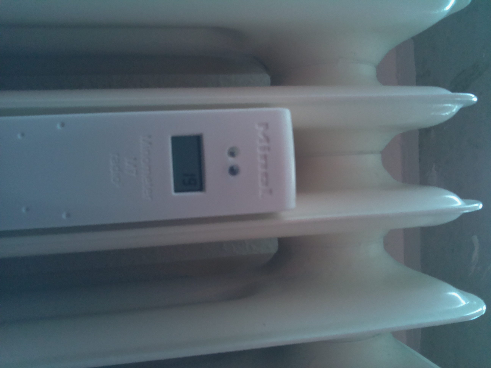
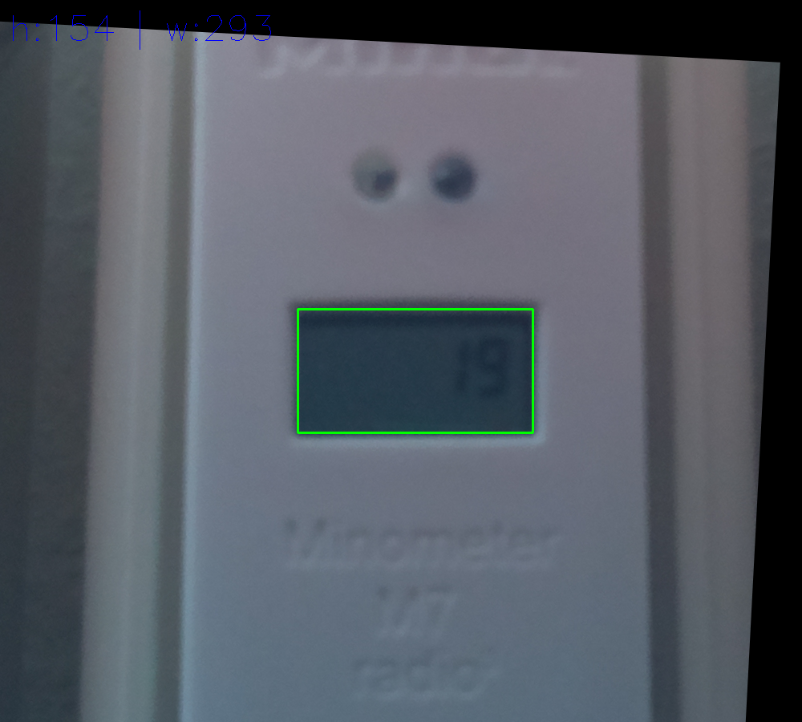

class: center, middle

# OpenCV with Python

Andreas Madsack (mfa)

datenobservatorium<br/>
2019-10-07

---

## About OpenCV

- https://opencv.org/

- fast computer vision library

- programmed in C++

- interfaces to lots of languages, i.e. Python

---

## Python installation

- Documentation is very C++ centric

- easiest installation is imho:

```
pip install opencv-contrib-python-headless
```

(this installs binary libraries too)

---

## My current opencv project

extract digits from minol heating sensors



---

## Demo time

(jupyter notebook)

--




---

## OpenCV tutorials / links

- https://github.com/spmallick/learnopencv

- https://github.com/yinguobing/head-pose-estimation

- https://www.pyimagesearch.com/2018/09/24/opencv-face-recognition/

---

## thanks

talk to me about

- opencv
- python
- machine-learning
