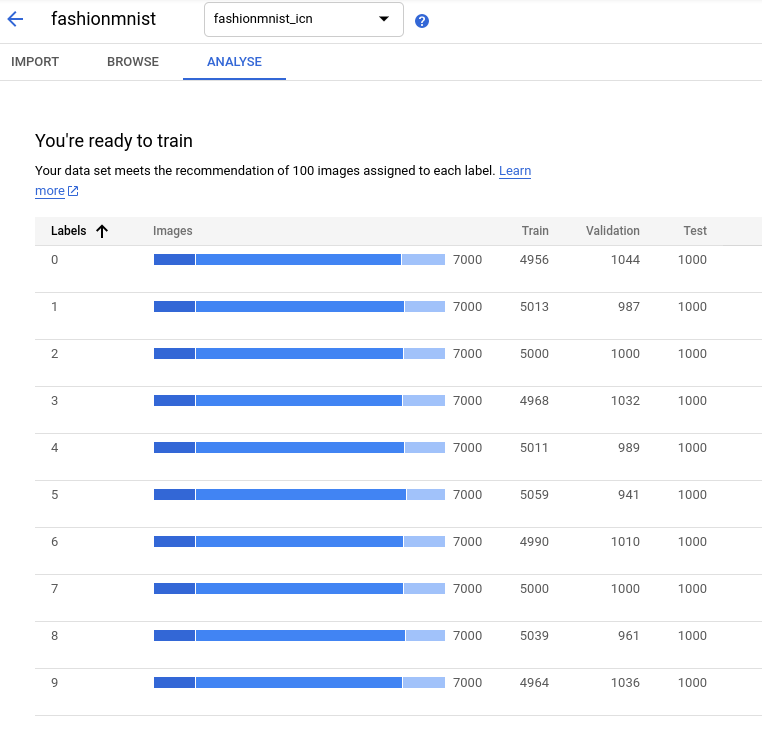

class: center, middle

# Google AutoML Demo

Andreas Madsack (mfa)

AX Semantics<br/>
2021-02-16

---

## Agenda

1. What is Google AutoML?

2. What is the competition?

3. First example: Fashion-MNIST

4. Second example: German Genus Classification

5. Why should I use Google AutoML?


---

## What is Google AutoML?

From https://cloud.google.com/automl/

```
Cloud AutoML enables developers with limited machine learning expertise to
train high-quality models specific to their business needs.
Build your own custom machine learning model in minutes.
```

Models for:

- image classification¹, object detection
- text classification¹
- translation, named-entity-detection, sentiment-analysis
- structured data

part of this talk: ¹

---

## What is the competition?

### generic

Overview: https://ml4aad.org/automl/

i.e.
- [MLBox](https://github.com/AxeldeRomblay/MLBox) is a powerful Automated Machine Learning python library.
- [H2O AutoML](http://docs.h2o.ai/h2o/latest-stable/h2o-docs/automl.html)
- [TPOT](http://epistasislab.github.io/tpot/) is a Python Automated Machine Learning tool that optimizes machine learning pipelines using genetic programming.
- [Auto-PyTorch](https://github.com/automl/Auto-PyTorch) - very early pre-alpha version


### structured data

[Google AutoML Tables](https://cloud.google.com/automl-tables/) vs. [AWS Sagemaker Studio Autopilot](https://aws.amazon.com/sagemaker/autopilot/) vs. [Azure ML Studio](): https://www.scieneers.de/automl-a-comparison-of-cloud-offerings/

---

## First example: Fashion-MNIST

https://github.com/zalandoresearch/fashion-mnist - direct drop-in replacement for the original MNIST dataset

Goal is the same as for MNIST:

- 10 classes
- lots of images (60000 for training; 10000 for test)
- only `28x28` pixel resolution


---

### Add Dataset to Google Storage

Somehow dated blog post shows how to import the data into Google Storage:
https://www.statworx.com/de/blog/a-performance-benchmark-of-google-automl-vision-using-fashion-mnist/

- My demo bucket: https://console.cloud.google.com/storage/browser/mfa-ml-demo/fashionmnist
- My dataset: https://console.cloud.google.com/ai/platform/locations/europe-west4/datasets/8862415563595448320/browse



---

### Train Model


---

### Evaluate


---


## Second example: German Genus Classification

One of my current work projects is to find the gender of a German noun.

i.e.
- `Hund` - male
- `Hundeschule` - female

First ideas where 3 or 4 class classification.

Google AutoML gave me the idea to use multi-class binary classification.

My current research version (using AllenNLP and PyTorch):
```
{
  "input": "Hund",
  "output": "masc",
  "probs": {
    "fem": 0.004836436826735735,
    "neut": 0.003499269252642989,
    "masc": 0.9984991550445557
  },
}
```

---

### Dataset

The format for text classification needs the `text` in the second column and all following columns as labels

```
,"Freundschaftsbeweis",MAS
,"Tschinderassabum",NEU
,"Bürgersinn",MAS
,"Umweltpolitikerin",FEM
,"Auswaschende",FEM,MAS,NEU
```

`Auswaschende` is a nominalized verb that can be used for all three genders.


---

### Train

No option to download model!


---

### Evaluate


---

### Predict

Using the Google AutoML Predict Api

Pricing: https://cloud.google.com/natural-language/automl/pricing

genus-request.json:
```
{
  "instances":
  [{
      "content":"Hundeschule"
}]}
```

request:
```
curl \
-X POST \
-H "Authorization: Bearer $(gcloud auth print-access-token)" \
-H "Content-Type: application/json" \
https://europe-west4-prediction-aiplatform.googleapis.com/v1beta1/projects/${PROJECT_ID}/locations/europe-west4/endpoints/6848497289602793472:predict \
-d "@genus-request.json"
```

(result on next slide)

---

### Predict -2-

returns:
```
{
  "predictions": [
    {
      "confidences": [
        0.998367428779602,
        0.0014990568161010742,
        0.0018229186534881592
      ],
      "displayNames": [
        "FEM",
        "MAS",
        "NEU"
      ],
      "ids": [
        "5760574514383552512",
        "1148888495956164608",
        "3454731505169858560"
      ]
    }
  ],
  "deployedModelId": "5811649028517003264"
}
```


---

## Why should I use Google AutoML?

- I use it to get a competitive baseline for my problem
- see if your data is good (enough) and solves your problem

### Pricing

- for me it was about 10€ / model for the NLP models (4-5h of training)
- and 20€ / model for fashion-mnist (8h cputime)

(all within the 300$ free budget in the first year of usage!)

---

## Questions?


