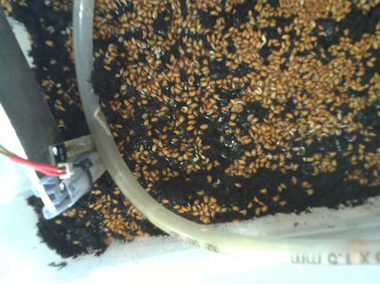

## Automatisierte Pflanzenzucht und maschinelles Lernen

Andreas Madsack (mfa)

MRMCD<br/>
2017-09-02

---

# Wie alles anfing


---

<!-- .slide: data-background="images/nasa_sticker.JPG" -->


### NASA SpaceApps Challenge 2016

im shackspace

2016-04-23 bis 2016-04-24

---

<!-- .slide: data-background="images/box_von_spaceapps_challenge.jpg" -->

---

<!-- .slide: data-background="images/1woche_box1_aufbau.JPG" -->

---

* Team von 10+ Personen
* danach noch zu dritt

* Danke an Stefan und Andreas H., die noch sehr aktiv dabei sind!

---

## Idee / Ziel

- Pflanzen züchten
- kontrolliert und automatisch
- mit günstiger Hardware

---

## Hardware

- RaspberryPI
- IKEA Samla-Boxen
- Raspicams
- Lüfter!
- billige Sensoren:
  - DHT22 (in der Box und ausserhalb)
  - Helligkeitswiderstand / -diode
  - Wassersensor

---

## Iterationen

- 100+ Cycles (Wachstumsphase von Pflanzen bis zur Ernte)
- erst Arduino für ADC, später 12bit ADC
- Logitech 720p Kamera, später Raspicams (5MP)
- Problematisch:
  - Messen des Wasserstandes
  - Wässern

---

## Wässern

---

<!-- .slide: data-background="images/box2_c39_watering.jpg" -->

---

<!-- .slide: data-background="images/IMG_20170305_193453_giessen.jpg" -->

---

<!-- .slide: data-background="images/IMG_20170625_192408_giessen_2.jpg" -->

---

## Böden

---

<!-- .slide: data-background="images/soil_cotton_IMG_20160828_192430.jpg" -->

# Watte

---

<!-- .slide: data-background="images/soil_seramis_IMG_7212.JPG" -->

# Seramis

---

<!-- .slide: data-background="images/soil_potting_IMG_20170813_192732.jpg" -->

# Blumenerde

---

## Speichern der Daten

- Django-Webseite mit REST-API
- Alle 5 Minuten Photo aus jeder Box und alle Sensorwerte
- 1x die Stunde wird die API abgefragt, ob gegossen werden soll

---

## Daten

- aktuell `>470000` Photos wobei `>100000` Photos von aussen (Kamera an der Decke über den Boxen) aufgenommen wurden.
- `>2.3 mio` Sensorwerte. davon `>1.5 mio` mit DHT22ern (Temperatur / Luftfeuchtigkeit) in der Box und im Raum.

---


---

## Exemplarischer Cycle




Ein Foto alle 5 Minuten eignet sich super für Zeitraffer

---

<!-- .slide: data-background-video="videos/c111_timelapse_480p.mp4" data-background-video-loop="1" -->

---

## Fails

---

<!-- .slide: data-background="images/box1_c1_schimmel_720p.jpg" -->

### Schimmel

---

<!-- .slide: data-background="images/box1_c23_vertrocknet.jpg" -->

### vertrocknet

---

<!-- .slide: data-background="images/box1_c2_unterwasser_720p.jpg" -->

### zu viel Wasser

---

<!-- .slide: data-background="images/box2_c4_full_of_water.jpg" -->

### noch mehr Wasser

---

<!-- .slide: data-background="images/box1_c3_schleimig_720p.jpg" -->

### schleimig

---

<!-- .slide: data-background="images/box2_c6_camera_moved.jpg" -->

### Kamera tape geht ab

---

<!-- .slide: data-background="images/water_sensor_fail.jpg" -->

### Wassersensor elektrolysiert

---

## Primärproblem!

- zuviel/zuwenig Wasser
- weil Sensor ungenau / sich auflöst
- Lösung: Deeplearning!
<!-- .element: class="fragment" data-fragment-index="2" -->

---

## Tensorflow / Keras

- Setup: Das Problem ist ein zwei Klassenproblem (ähnlich zu cats vs. dogs)
- Hier: trocken vs. feucht

---

### Experimente zusammentragen

| cycle_id | plant | soil | score* |     water threshold |
|-
|      110 | cress | potting | ++  |      6000 |
|       72 | cress | red  | ++     |      8000 |
|       65 | phacelia | red | ++   | 8000 |
|       24 | cress | cotton | ++   | 610 |

---

### Trainingsdaten

- Jedes Foto dem nächstem Wassersensorwert zuordnen

|Photo | seconds photo | seconds sensor | sensor value |
|-
|1496589601.jpeg | 1202338 | 1202346 | 3793 |

seconds from cycle start

---

Wassersensor


---

Feucht-/Trocken-Ratio (pro Cycle)

| |  |  |
|-
|threshold: 3000 | threshold: 6000 | threshold: 8000 |

---

Feucht/Trocken-Ratio


threshold 3000, 6000, 8000

(Tensorboard Conv2d bias)

---

zum Gewichten (dry/wet):
```
from sklearn.utils import class_weight

class_weight.compute_class_weight('balanced', np.unique(y), y)
```

``.fit()`` hat einen parameter ``class_weight``

---

- Photos verkleinern (128x96 bzw. 256x192)


---


### Model - Keras

```python
model = Sequential()
model.add(Conv2D(32, (3, 3), input_shape=(image_height,
                                          image_width, 3)))
model.add(Activation('relu'))
model.add(Conv2D(32, (3, 3)))
model.add(Activation('relu'))
model.add(MaxPooling2D(pool_size=(2, 2)))
model.add(Dropout(0.25))
model.add(Flatten())
model.add(Dense(64, activation='relu'))
model.add(Dropout(0.5))
model.add(Dense(2, activation='softmax'))
model.compile(loss='binary_crossentropy', optimizer='adam',
              metrics=['accuracy'])
```

---

### Conv2d


---


### Model - Keras

```python
model = Sequential()
model.add(Conv2D(32, (3, 3), input_shape=(image_height,
                                          image_width, 3)))
model.add(Activation('relu'))
model.add(Conv2D(32, (3, 3)))
model.add(Activation('relu'))
model.add(MaxPooling2D(pool_size=(2, 2)))
model.add(Dropout(0.25))
model.add(Flatten())
model.add(Dense(64, activation='relu'))
model.add(Dropout(0.5))
model.add(Dense(2, activation='softmax'))
model.compile(loss='binary_crossentropy', optimizer='adam',
              metrics=['accuracy'])
```

---

### Dropout

```python
model.add(Dropout(0.25))
```

```python
model.add(Dropout(0.5))
```

---

### Model - Keras

```python
model = Sequential()
model.add(Conv2D(32, (3, 3), input_shape=(image_height,
                                          image_width, 3)))
model.add(Activation('relu'))
model.add(Conv2D(32, (3, 3)))
model.add(Activation('relu'))
model.add(MaxPooling2D(pool_size=(2, 2)))
model.add(Dropout(0.25))
model.add(Flatten())
model.add(Dense(64, activation='relu'))
model.add(Dropout(0.5))
model.add(Dense(2, activation='softmax'))
model.compile(loss='binary_crossentropy', optimizer='adam',
              metrics=['accuracy'])
```

---

### Dense

```python
...
model.add(Flatten())
model.add(Dense(64, activation='relu'))
model.add(Dropout(0.5))
model.add(Dense(2, activation='softmax'))
model.compile(loss='binary_crossentropy', optimizer='adam',
              metrics=['accuracy'])
```

---

### Ein Model pro Cycle trainieren

 (für verschiedene Cycles)

---

Beispiele für accuracy und validation_accuracy:


cycle 74 / 8000 (orange), cycle 85 (cyan) / 3000

(Tensorboard)

---

### Model gegen alle anderen Cycles evaluieren.

<span style="color:red">trained: 74</span>, image_width: 128, threshold: 8000

|acc|evaluated|plant
|-
|0.960140|74|cress-seramis
|0.872432|83|phacelia-seramis
|0.790552|67|phacelia-seramis
|...|||
|0.173048|91|phacelia-seramis


---


### Model bestehend aus mehreren Cycles trainieren:

- Kresse mit Seramis:

  <font size=6>71 72 74 78 98 99 100 101 102 103 104 105 106 107 108 109</font>

- Phacelia mit Seramis:

  <font size=6>64 65 66 67 <span style="color:red">68</span> 69 <span style="color:red">70</span> 73 <span style="color:red">75</span> 76 <span style="color:red">77</span> <span style="color:red">83</span> <span style="color:red">84</span> 87 88 89 <span style="color:red">90</span> 91 92 <span style="color:red">94</span> 95 <span style="color:red">96</span> 97</font>


---

### Single Cycle vs. Multi Cycle


cycle 74 (orange), 16 cycles von cress-Seramis (cyan)

(alle mit threshold 8000)


---

### (multi) Model gegen alle anderen Cycles evaluieren.

<font size=5>
<span style="color:red">trained: 71+72+74+78+98+99+100+101+102+103+104+105+106+107+108+109</span>, threshold: 8000</font>

|acc|evaluated|plant
|-
|0.999465|102|cress-seramis
|0.685553|65|phacelia-seramis
|0.204918|92|phacelia-seramis

---

<span style="color:red">trained: 68+70+75+77+83+84+90+94+96</span>, t: 6000

|acc|evaluated|plant
|-
|1.0|90|phacelia-seramis
|0.929459|69|phacelia-seramis
|0.848802|78|cress-seramis
|0.055431|88|phacelia-seramis


---

- Python-Code und Daten als hdf5/csv gibt es unter:

  https://cress.space/mrmcd17/

- Bei Fragen, Ideen, Fehlern, Anmerkungen bitte an
  <span style="color: red">andreas@madflex.de</span> oder <span style="color:red">@mfandreas</span>

- Vielen Dank für eure Aufmerksamkeit!
